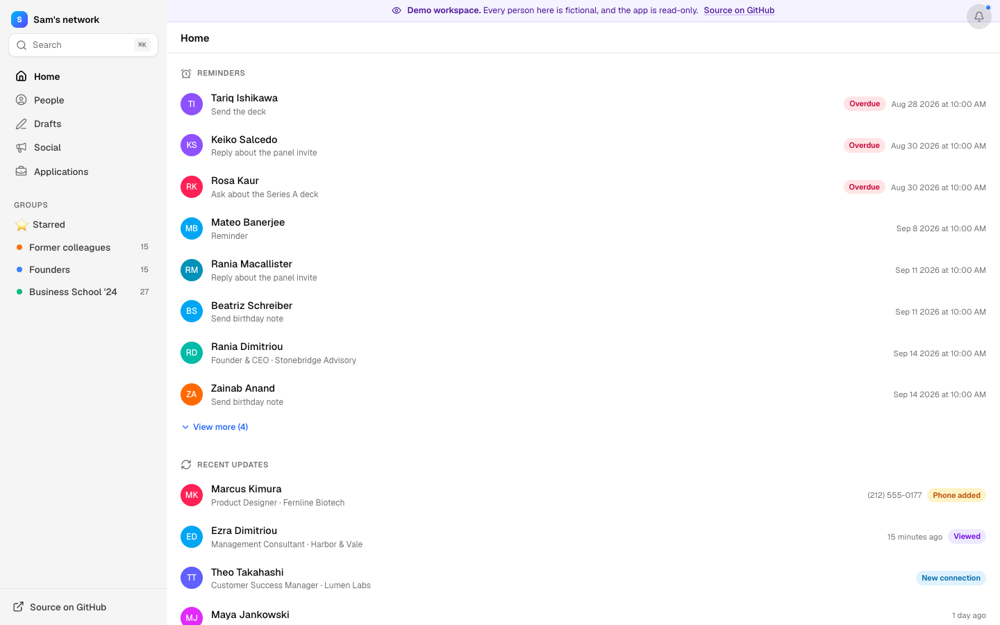

# Rontext

A personal CRM for the people you actually know. Rontext keeps one record per person, layers on what LinkedIn, Gmail, Messages and Calendar quietly know about them, and turns that into a Home feed of who to talk to next: reminders, birthdays, headline changes, people you've gone quiet on.

It started as a self-hosted replacement for a paid networking app and grew into a small system: a Next.js app on Vercel, a Postgres database, nightly jobs, an MCP server so an AI agent can read and draft on your behalf, a Chrome extension that captures LinkedIn profiles as you browse, and a Mac agent for iMessage counts. Every byte stays in a database you own.

**Live demo:** https://rontext-demo.vercel.app · read-only, every person in it is fictional.



## What it does

- **People.** One profile per person with contact details, groups, education, attached PDFs, notes, a map of where they are, and a timeline that merges notes, reminders, drafts, LinkedIn changes and monthly interaction counts.
- **Home.** Overdue and upcoming reminders, recent LinkedIn headline changes rendered as word diffs, new connections, people you recently viewed, upcoming birthdays, latest notes.
- **Network graph.** A force-directed map of your network clustered by employer, with company logos and a detail panel per hub.
- **Drafts.** Outreach messages per person (email, SMS, LinkedIn). Optional AI drafting in your own voice, learned from drafts you wrote by hand. Nothing is ever sent automatically: sending is a handoff to Gmail, Messages or LinkedIn with the text on your clipboard.
- **Social.** Draft posts for LinkedIn, X and Instagram with pixel-faithful previews, plus follower and post analytics as time series.
- **Applications.** A small job-application tracker with resume and cover-letter slots.
- **Imports.** CSV from LinkedIn or your old CRM, vCard or Google Contacts export (the only source of birthdays and photos), and a review queue for people your inbox knows that the CRM doesn't.
- **Automation.** A daily Vercel cron runs Gmail, Calendar, Google Contacts, GitHub and backup jobs. A Chrome extension captures LinkedIn profiles passively and visits a capped number of due profiles each evening. A launchd agent on the Mac counts iMessage conversations without the messages ever leaving the machine.
- **MCP server.** Eight tools (search, get, reconnect suggestions, reminders, notes, drafts) behind a separate bearer token, so Claude or any MCP client can work your network. Read plus safe writes only; there is no send tool.

## Stack

Next.js 16 (App Router, server actions) · TypeScript · Tailwind v4 + shadcn/Base UI · Drizzle ORM on Neon Postgres · Vercel (cron, Blob backups) · jose for the session cookie · Sigma/graphology for the graph · Anthropic API for drafting (optional).

There is no multi-user layer on purpose. One deployment is one person's network, protected by a passcode, and the sensitive integrations (your inbox, your messages, your LinkedIn session) only ever talk to your own database.

## Self-host

You need a Vercel account and about ten minutes. The app runs fine on free tiers.

[](https://vercel.com/new/clone?repository-url=https%3A%2F%2Fgithub.com%2Frhussar%2Frontext&project-name=rontext&repository-name=rontext&env=APP_PASSCODE,SESSION_SECRET&envDescription=APP_PASSCODE%20is%20the%20passcode%20you%20will%20sign%20in%20with.%20SESSION_SECRET%20is%20any%20long%20random%20string.&envLink=https%3A%2F%2Fgithub.com%2Frhussar%2Frontext%23self-host&stores=%5B%7B%22type%22%3A%22integration%22%2C%22integrationSlug%22%3A%22neon%22%2C%22productSlug%22%3A%22neon%22%2C%22protocol%22%3A%22storage%22%7D%5D)

1. **Deploy.** The button clones this repo into your GitHub, creates a Vercel project, attaches a Neon Postgres database from the Marketplace, and asks for two values: the passcode you will sign in with and a session secret (any long random string, for example `openssl rand -hex 32`).
2. **Create the tables.** Clone your copy, then:
   ```bash
   npm install
   npx vercel link
   npx vercel env pull .env.local
   set -a && source .env.local && set +a && npm run db:push
   ```
3. **Sign in** at your deployment URL with the passcode, open Settings → Connections, and import a CSV, a vCard or a Google Contacts export.
4. **Optional keys**, all entered in Settings → Connections and stored in your database (no redeploy): an Anthropic key for AI drafting, a Google OAuth client for Gmail/Calendar/Contacts sync, a GitHub token for repo analytics, an unavatar key for profile photos. Each integration shows its own status and a Sync button.

The Chrome extension and the Mac agent are optional and documented in Settings → Connections once the app is running.

### Run locally

```bash
cp .env.example .env.local   # or create it: DATABASE_URL, APP_PASSCODE, SESSION_SECRET
npm install
npm run db:push
npm run dev
```

## Demo mode

The public demo is the same code with `DEMO_MODE=1` and a database seeded by `npm run seed:demo`. In demo mode the database accessor refuses every write, visitors are signed in automatically, and the mutation controls are hidden. The seed generates 250 fictional people, companies and schools from word lists in `scripts/demo-data.ts`; it refuses to run against any database not named `rontext_demo`.

## Data

Everything human-authored can be exported at any time as CSV (round-trips through the importer) or JSON (the same document the nightly backup writes). Nothing about your contacts is sent to a third party except the optional calls you configure: Nominatim for geocoding a city name, unavatar for a profile photo, Anthropic when you press the sparkle.

## License

AGPL-3.0. Run it, change it, self-host it; if you offer a modified version as a service, share the changes.
